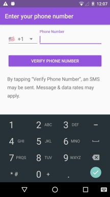
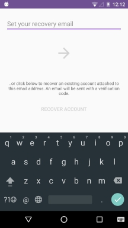
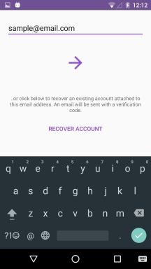
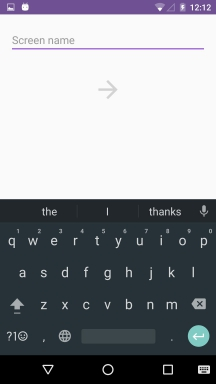
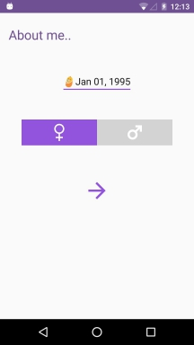
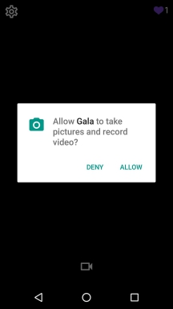
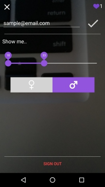

# Gala (Android)

Testing ground for best practices in Firebase integration, camera management, identity workflow, etc.

## Up next
* Fully integrate Twilio API
* Smooth out camera preview functionality
* Revamp some UI components

## User login/settings flow

